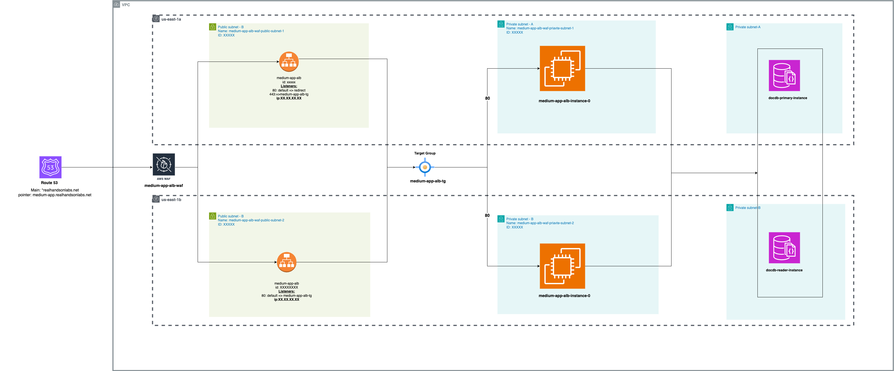

# Terraform AWS Infrastructure for Express.js Application

This repository contains Terraform code to provision the infrastructure required for an Express.js application. The infrastructure includes Route 53 as the entry point, AWS WAF for security, an AWS Application Load Balancer (ALB), a target group, and two EC2 instances and documentDB primary and reader instances in different availability zones for high availability.

## Architecture




## Prerequisites

Before you begin, ensure you have the following:

- Terraform installed
- AWS CLI configured with appropriate access rights
- A domain name managed by Route 53

## Usage

Clone the Repo

``` bash
git clone https://github.com/saksman3/medium-alb-waf-app-terraform.git
cd medium-alb-waf-app-terraform

```

Create workspace and initiliaze Terraform (this assumes that you already have terraform initialized, and uses terraform cloud for state management), also the workspace would differ according to the environment dev, stage,prod

```bash
Terraform workspace new dev # this will create a dev workspace.
Terraform init #initialises terraform on the new workspace.
```

Review and Modify variables as per your requirements

- Variables in the variables.tf file
- Modify variable values in the file envs/dev.tfvars -> you can add another file for your respective environment for an example you may have stg.tfvars for stage environment / pro.tfvars for production

Run Plan and Apply to apply your terraform configs

```bash
terraform apply
```

   confirm the apply with "yes"

Inputs


| Name | Type | description |
| ------ | ------ |------ |
| env   | string   |   environment being provisioned     |
| product   | string   |   Top Level Resources Identification.     |
| ec2_instance_count_medium_app   | number   |   number of ec2 instances to provision     |
| ec2_volume_size   | number   |   ec2 instances volume size     |
| ec2_ami   | string   |   Amazon machine Image to use for the instances     |
| ec2_instance_type   | string   |   Amazon EC2 instance types     |
| availability_zones   | string   |   Availability zones to deploy your infra in   |

## Contributing

Contributions are welcome! Please open an issue or submit a pull request for any improvements or bug fixes.

License
This project is licensed under the MIT License - see the LICENSE file for details.